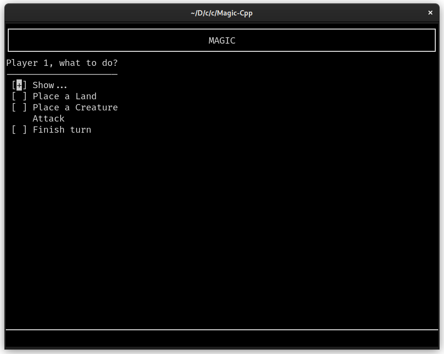
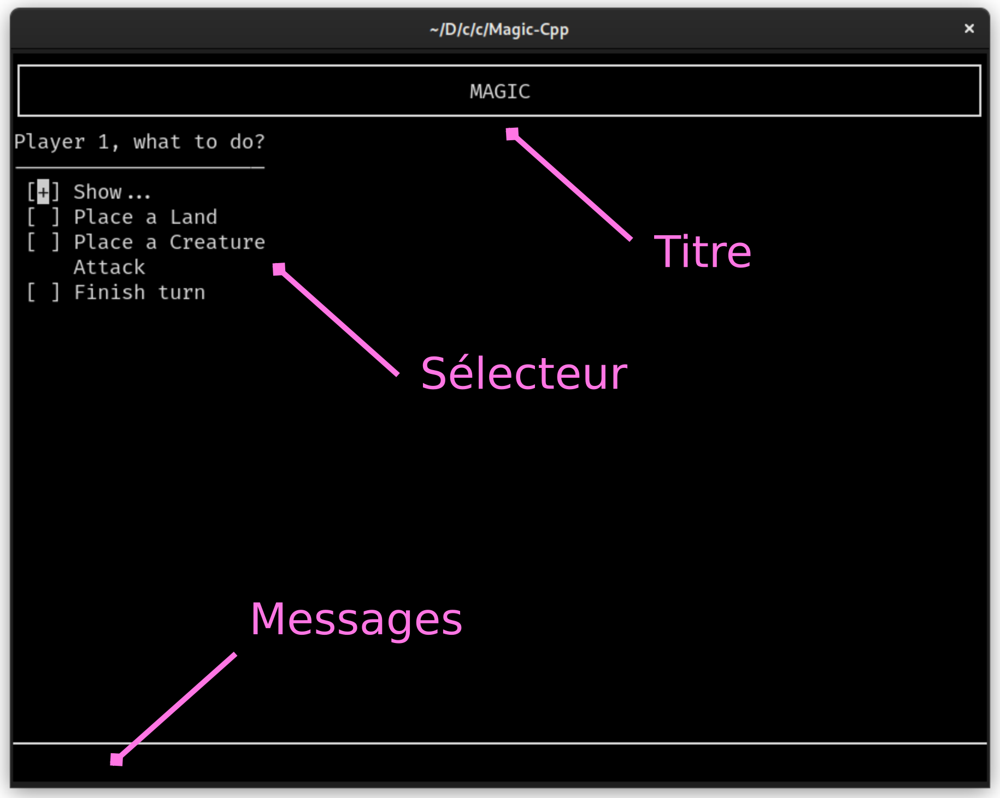

% Projet ET4 C++ -- Magic: The Gathering
% Guillaume Descomps;Mathis Brossier
% 21 Janvier 2022

# 1. Présentation

Pour ce projet, nous nous sommes concentrés sur le développement de la *base* imposée par l'énoncé vu le peu de temps disponible.
Le jeu comporte une interface en console (*CLI*) réalisé avec la bibliothèque C "*ncurses*".

# 2. Notice d'utilisation

## Démarrage

Lancer le programme (`./bin/magic`) dans un terminal (préférentiellement linux, avec un support *unicode* et couleurs *ANSI*).
Au lancement du programme, une partie est immédiatement lancée avec le début du tour du joueur 1.
Les deux joueurs démarrent avec 7 cartes dans leur main et 20 points de vie.
Le jeu est en anglais.

## Interface

L'interface est composée d'un encart de *titre* en haut du terminal et d'éléments intéractifs comme le *sélecteur* et la *boîte de messages*.

**Le sélecteur** est navigable avec les touches directionnelles `haut ↑` et `bas ↓`. 
Suivant le *mode* du sélecteur, le joueur peut sélectionner des entrées avec la touche `espace`.
La confirmation se fait avec la touche `entrée`.

Le sélecteur peut être en 3 différents *modes* :

* sans sélection (`moins -` sur le curseur)
* sélection simple (`plus +` sur l'entrée sélectionnée)
* sélection multiple (`étoile *` sur les entrées sélectionnées)

Finalement, une ou plusieurs entrées du sélecteur peuvent être *désactivés*, elles sont alors non sélectionnables par le curseur et les crochets de sélection ne s'affichent pas.

**La boîte de messages** peut écrire des messages informatifs au joueur ou lui poser des questions.
Elle peut aussi demander au joueur de répondre `yes/no` à une question.
Le joueur valide sa réponse avec la touche `entrée`.

## 3. Tour de jeu

Le déroulement du jeu est bien guidé par la boîte de messages qui affiche les actions a effectuer à chaque étape. Les subtilités sont détaillées ici :

 * Le jeu démarre immédiatement par la pioche du joueur 1. Lors de la pioche, la carte s'affiche au centre du terminal. Attention, le joueur adverse ne doit pas regarder !
 * Ensuite s'affiche le menu principal dans lequel choisir entre *afficher des cartes*, *poser une carte* terrain ou créature, *attaquer* ou *finir le tour*.
 * Conformément au règles, le joueur ne peut poser qu'une seule carte terrain par tour et ne peut attaquer qu'une fois.
 * Lors de la pose d'une créature, le joueur est dabord demandé quelles cartes terrain il souhaite engager et **ensuite** quelle créature poser.
   Le jeu proposera une liste de créatures correspondant *exactement* aux cartes terrain engagées.

# 4. Fonctionnalités

Le projet comporte la *base* avec en plus une jolie interface console.

Nous avons décidé d'utiliser système d'historique de "duels" pour représenter les combats. Un duel oppose un attaquant et aucun, un ou plusieurs défenseurs. 
Les duels sont créés par étapes successives de choix des deux joueurs puis exécutés au cours de la partie. Cela permettra d'implémenter une sauvegarde de partie ou des interactions en ligne.

Nous prévoyons d'ajouter des abilités et éventuellement un serveur multijoueur suivant le temps et les difficultées rencontrées.

Nous n'avons pas eu le temps de faire beaucoup de tests pour l'instant.

# 5. Difficultés rencontrées

Sur l'organisation, nous avons des visions différentes sur les principes OO tels que l'extensibilité et l'héritage, ce qui a rendu l'établissement de l'UML compliqué.

Sur la modélisation, la difficulté principale du projet est de trouver un bon niveau de généricité de façon à pouvoir coder de nouvelles fonctionnalités sans tout refactoriser.

En particulier la gestion des duels est compliquée, il est difficile de faire respecter toutes les *capacités* des cartes. Certaines capacités font l'objet d'exeptions dans le code comme Initiative.

# 6. Compilation et Exécution

Un *Makefile* est disponible. Il compile les `.o` et l'exécutable final dans le dossier `bin`. L'exécutable s'appelle `magic`. 

La compilation requiert un compilateur de c++ supportant la norme c++20. Le makefile est configuré pour utiliser `clang++`.
Le projet dépend de la bibliothèque ncurses qui est installée par défaut sur la plupart des distributions linux.